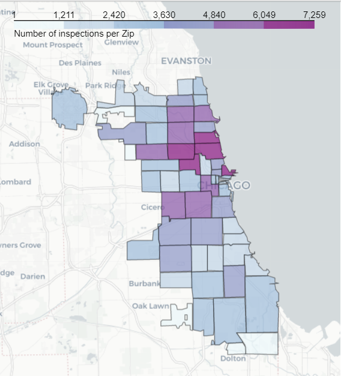

# Title

A study on Food Security in Chicago

# Abstract

USA is a country who puts a large importance on food and has a very diverse food culture. We also have that Chicago is one of the most influential cities in the North American country. We want to combine these two insights in order to build an analysis on the food industry as it pertains to Chicago, but with a very specific viewpoint: we will look at how safe is to eat or buy food in Chicago.

We will use Chicago Department of Public Health’s corpus, containing data from inspections made in food establishments, in order to create a meaningful study on food security in the city. We would like to focus on understanding the reasons behind violations on the Public Health’s laws, and see if we can draw relations on the area environment, such as average income, geographical location or social status.

### Title of result

We believe that conclusions extracted from such study will help to better understand this outstanding city. Lorem ipsum dolor sit amet, consectetur adipiscing elit, sed do eiusmod tempor incididunt ut labore et dolore magna aliqua. Ut enim ad minim veniam, quis nostrud exercitation ullamco laboris nisi ut aliquip ex ea commodo consequat.

 

# Research questions
After considering the opportunities and limitations of the corpus, together with the feedback provided from Milestone 1, we have updated our research questions. We propose the following:

- What connections can be found between economic prosperity and the frequency of the inspections in an area, i.e. is there some bias? Is there also a connection between economic prosperity and food safety and types of violations?
- Are there differences in food safety between big companies and franchises and small businesses?

Although we think that addressing these topics has the potential for a good data story, we are still open to change the focus or pivot to a different topic in case we encounter with unexpected results that are considered to be more interesting.

# Dataset
The main dataset that we will use is the [Chicago Food Inspections](https://www.kaggle.com/chicago/chicago-food-inspections) dataset, which contains information regarding inspections of food establishments in Chicago. The earliest entries are from January 1, 2010 and the newest ones are from October 23, 2019. This is a dataset provided by the City of Chicago, and inspections are performed the Chicago Department of Public Health’s Food Protection Program, so we can assume the veracity of the data.

The corpus includes data of nearly 200.000 inspections. It is formatted in one CSV file, which makes a first visual inspection on all the corpus easier. Inspection features include the name of the establishment, its type (grocery store, restaurant, daycare, etc), its address and zip code, its risk of adversely affecting the public’s health, the result of the inspection together with detailed comments, and the date the inspection was done.

Although some characteristics may need formatting, a first look at the dataset indicates that the data is well structured and consistent throughout the corpus, which is good news for us. However, according to Kaggle's description: _"attempts have been made to minimize any and all duplicate inspection reports. However, the dataset may still contain such duplicates and the appropriate precautions should be exercised when viewing or analyzing these data"_. For this reason, we will need to do a further analysis in order to pre-process the provided dataset towards our goals. Also, the Violations column contains detailed but uncategorized information of the inspections, which could be transformed into a more digestible format through pre-processing.

Additionally, we will try to support our findings with auxiliary information regarding the City of Chicago. We have checked on several possible resources, such as income statistics provided by the [United States Census Bureau](https://www.census.gov/data.html) . The data from the Census Bureau is provided by Data USA in a more easily accessible form. For the city of [Chicago](https://datausa.io/profile/geo/chicago-il/) they provide several datasets. The Census Bureau also provides [geographical data](https://www.census.gov/programs-surveys/geography.html) about states, cites, zip codes, and survey tracts. Besides, as the City of Chicago has plenty of open source datasets, research will be conducted to find useful information.

# A list of internal milestones up until project milestone 2

- [x] Decide on the tasks and duties of each of the members of the group.
- [x] Find a resource that allows us plot an accurate map of Chicago, including a division per ZIP Code. This is of vital importance in order to succeed in our map plots, which we believe are crucial for the analysis.
- [x] Find out the differences between different inspection types (Canvass, License, etc.) and different types of establishments.
- [x] Gather from external sources as much supporting information as possible, in order to enrich the analysis. This includes the average income per zone in Chicago, a more accurate segmentation of the type of business (e.g.: for restaurants, we could divide them in Italian, Japanese, Mexican or state owned versus privately owned, etc.), or locations of main tourist attractions, among others.
- [x] Pre-process the provided dataset in order to solve potential NULL values, duplicate inspection reports, or other inconsistent data.
- [x] Extract interesting information from the Violations column.
- [x] Plot and analyze different relations between columns to give us an indication of which of the research questions we can take on.
- [ ] ~~Once we have a better idea of the opportunities and limitations of the corpus, discuss narrative of the data story.~~

# A list of internal milestones up until project milestone 3

- [ ] Perform data analysis in order to obtain a complete research of the questions proposed for our project.
- [ ] Once considered all the opportunities and limitations of the corpus, discuss the narrative to follow for our project.
- [ ] Based on our findngs, discuss whether to go for a data story or a report.
- [ ] Iterate through the final document to obtain the best possible results/analysis.

# Questions for TAs

No questions :)
