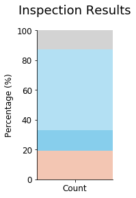
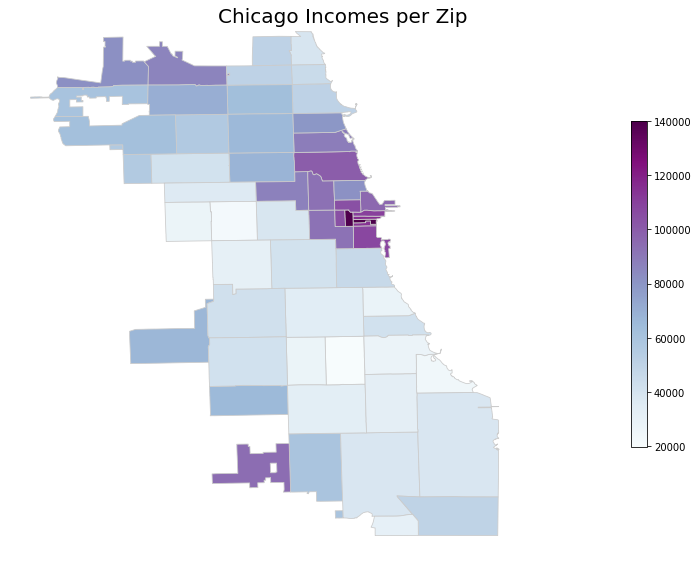
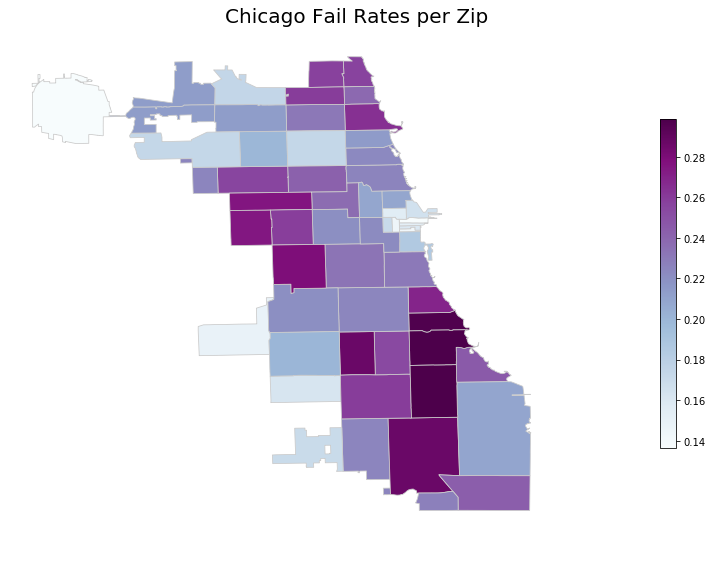
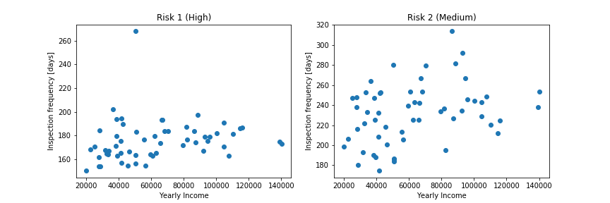
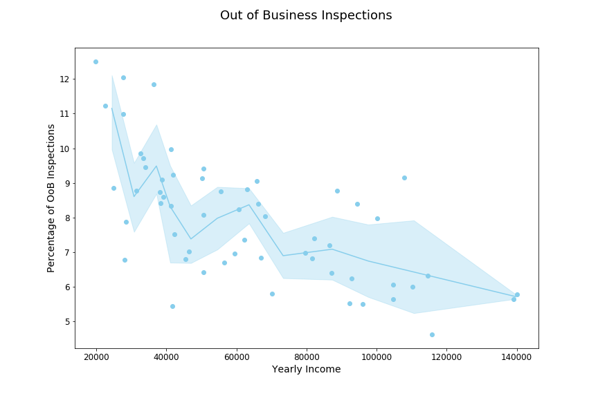
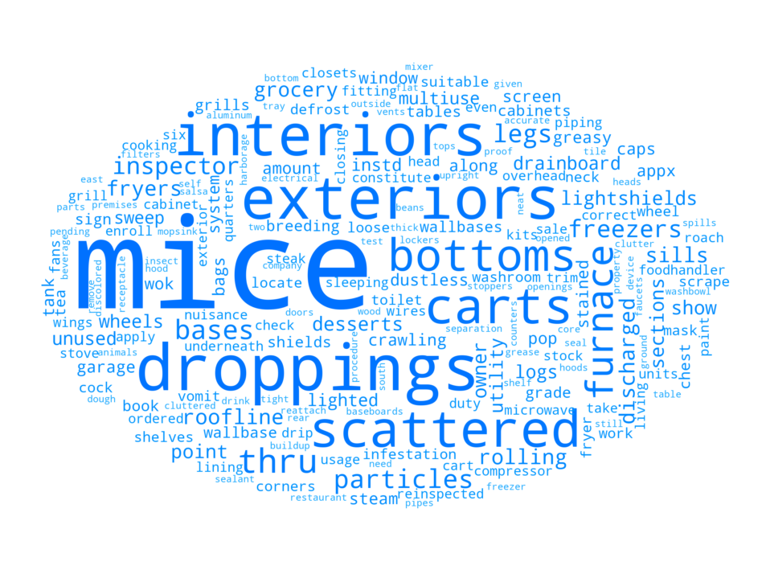
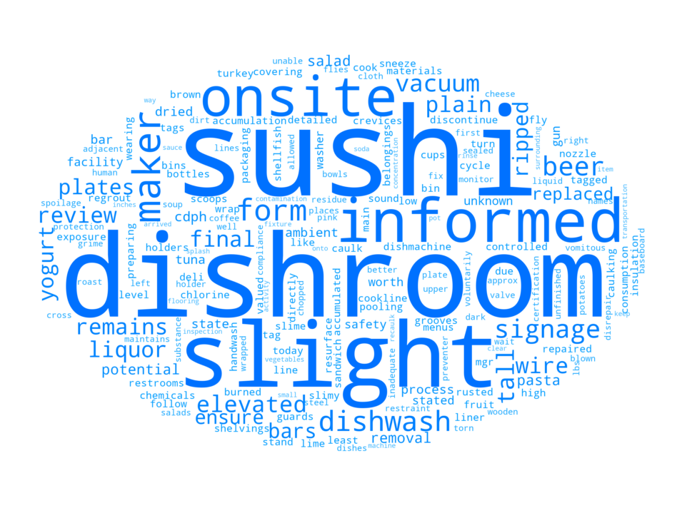
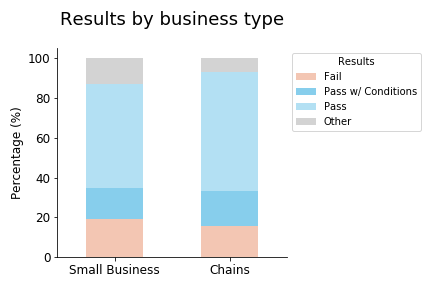
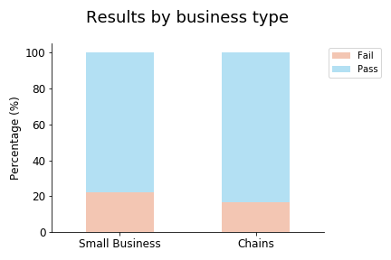

USA is a country who puts a large importance on food and has a very diverse food culture. We also have that Chicago is one of the most influential cities in the North American country. We want to combine these two insights in order to build an analysis on the food industry as it pertains to Chicago, but with a very specific viewpoint: we will look at how safe is to eat or buy food in Chicago. Specifically, we would like to focus on two main aspects: how can economic prosperity of an area influence in the frequency of inspections and violations, and an in-depth comparison between large franchises and small businesses. We believe that the conclusions extracted from such study will help to better understand this outstanding city. Let's start off!

## Data-set
We used the [Chicago Food Inspections dataset](https://www.kaggle.com/chicago/chicago-food-inspections) dataset containing a list of the inspections of food establishments in Chicago from January 1, 2010 to the present.

Each line of the dataset represents an inspection and gives us information about the establishment itself, the result of the inspection, the violations detected and others.

Below is an example with only the more relevant columns kept:

|__Name__: _Chipotle Mexican Grill_|
|---|
|__Facility Type__: Restaurant|
|__Zip__: 60657|
|__Results__: Pass w/ Conditions|
|__Violations__: |
| 16. food-contact surfaces: cleaned & sanitized - comments: noted a very thick black and slimy substance inside the upper compartment of ice machine dripping onto the ice. Instructed management not to use ice machine until equipment is detail cleaned and sanitize. Priority foundation #7-38-005 |
| 37. Food properly labeled; original container - comments: noted bulk food items stored inside containers at the dry storage not properly labeled. Instructed management that all bulk and working food ingredient containers must be labeled with contents name. |
| 47. Food & non-food contact surfaces cleanable, properly designed, constructed & used - comments: noted foil paper used to line shelves. Instructed to clean and remove all foil paper to prevent hiding places for pest. |
| 55. Physical facilities installed, maintained & clean - comments: noted cracks on floor at the basement dry storage area. Instructed to seal and resurface crack on floor to make them smooth and easily cleanable. |
| 55. Physical facilities installed, maintained & clean - comments: noted stained tiles on walls and ceiling by the 3 compartment sink. Instructed to detail clean and maintain.  |
| 58. Allergen training as required - comments: noted certified food managers on duty with no allergen training certification. Instructed management that all food service managers are required to have the allergen training certification.|

As can be seen most of the data is has results that are either: __Pass__, __Pass w/ Conditions__ or __Fail__. We will only be basing ourselves off that data.

There are many different establishment types:
- Restaurants make up __67%__ of the data.
- Grocery stores make up __13%__ of the data.
- The rest of the data is __20%__ of the data.

For the purpose of this work we look more closely at the restaurants.

## Part 1: Is richer safer ?

We have compared inspections based on the [income for each zip code](https://towardsdatascience.com/getting-census-data-in-5-easy-steps-a08eeb63995d)

 

From the maps it is easy to see that the few areas of high income seem to have a lower fail rate than the others.

There could be many ways this data is biased, for one the inspectors might be biased against restaurants in low income areas. To get a deeper look into this we looked at the actual violations that occurred. We saw the most noticeable difference for violation 18: “No evidence of rodent or insect outer openings protected/rodent proofed, a written log shall be maintained available to the inspectors”

#### Are poorer areas more targeted by inspections?

All establishments get assigned to a risk group. There are three groups:
- __High risk__
- __Medium risk__
- __Low risk__

We will not look at the low risk group because they are so uncommon that we don't have enough data on them.

On the graph beside we see the average time between inspection per establishment for every zip code.
There doesn't seem to be any clear bias visible.

 

 

But we still see that areas with a lower income have a higher rate of going out of business.
WHY DO WE CARE? TEXT

 

#### Checking the specific violations:

In the graph beside we have the violations which show the most differences.
ADD SOME TEXT TO TALK ABOUT THIS

 

Let's analyse the most common words from the violations:

    

     <b>Low Income Area</b>
      
     
    

    

     <b>High Income Area</b>
      
     
    

 

TEXT ON WORD CLOUDS

## Part 2: Chains vs Businesses

The concept of restaurant chains build upon a very simple idea: that you can get the same food regardless of where you buy it. A Big Mac in New York should taste the same as a Big Mac in Chicago. Also, quality between establishments should be the same, since the company has a reputation to live up to. Does this quality extend to food safety? Are there any differences in food safety between small businesses compared to chains?

We extracted the [list of food chains](https://en.wikipedia.org/wiki/List_of_restaurant_chains_in_the_United_States) from Wikipedia to find all the big restaurant chains in the United states. For the rest of the restaurants, we assume that they are privately owned restaurants with no association to a restaurant chain.

We slightly quantize the data by setting __"Pass"__ as both "Pass" and "Pass w/ Conditions", and "Fail" as just "Fail". The other rows are not connected to the safety of the establishment.

We choose the failure rate as the safety measurement, as a customer going to a restaurant that would fail an inspection is unsafe. Because the __Fischer exact test__ gives us a p-value lower than 0.01 we can deduce from the plots above that chains fail inspections less often and so are safer.  

#### Violations between chains and businesses

We see that the different groups are prone to making the same violations.
However, violation 21 is clearly overrepresented in chains compared to small businesses, which corresponds to a lack of food service manager when handling hazardous foods, such as deli meats and sandwiches.
Small businesses are highly overrepresented in: violation 25, which corresponds to toxic items not stored properly, and violation 23, which concerns date labeling refrigerated food.

## Tying it together, are chains richer?

We can find a strong correlation between high income areas and food safety, as well as a higher safety in restaurant chains compared to privately owned restaurants. The big question here is: Can we find a correlation between the percentage of restaurant chains and high income? Our hypothesis is that if a higher percentage of chains are found in more high income areas compared to low income areas, food safety is not necessarily related to the type of restaurant, and instead related to the income of an area. This is simply done by grouping the chains by their zip code, and plotting the counts against the incomes per zip code, as seen below.

We find a correlation of 0.145(CHANGE!), which is a very weak correlation! For example, the area with zip code 60621, with the third highest concentration of restaurant chains, has the lowest income. In contrast to this, the area with zip code 60606 in the city center has the fourth highest concentration of restaurant chains, but the second highest income!

From these results, we conclude that there are different factors that make high income areas and restaurant chains safer.
