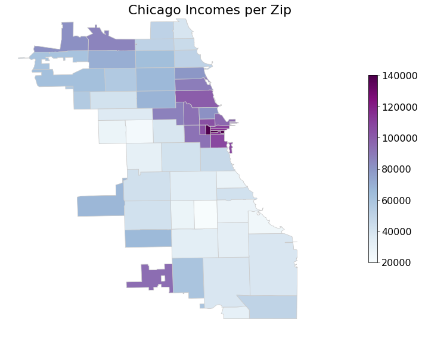

# Title

A study on Food Security in Chicago

# Abstract

## Data-set
We used the [Chicago Food Inspections dataset](https://www.kaggle.com/chicago/chicago-food-inspections) dataset containing a list of the inspections of food establishments in Chicago from January 1, 2010 to the present.

Each line of the dataset represents an inspection and gives us information about the establishment itself, the result of the inspection, the violations detected and others.

Below is an example with only the more relevant columns kept:

|__Name__: _Chipotle Mexican Grill_|
|---|
|__Facility Type__: Restaurant|
|__Zip__: 60657|
|__Results__: Pass w/ Conditions|
|__Violations__: |
| 16. food-contact surfaces: cleaned & sanitized - comments: noted a very thick black and slimy substance inside the upper compartment of ice machine dripping onto the ice. Instructed management not to use ice machine until equipment is detail cleaned and sanitize. Priority foundation #7-38-005 | 
| 37. Food properly labeled; original container - comments: noted bulk food items stored inside containers at the dry storage not properly labeled. Instructed management that all bulk and working food ingredient containers must be labeled with contents name. | 
| 47. Food & non-food contact surfaces cleanable, properly designed, constructed & used - comments: noted foil paper used to line shelves. Instructed to clean and remove all foil paper to prevent hiding places for pest. | 
| 55. Physical facilities installed, maintained & clean - comments: noted cracks on floor at the basement dry storage area. Instructed to seal and resurface crack on floor to make them smooth and easily cleanable. | 
| 55. Physical facilities installed, maintained & clean - comments: noted stained tiles on walls and ceiling by the 3 compartment sink. Instructed to detail clean and maintain.  | 
| 58. Allergen training as required - comments: noted certified food managers on duty with no allergen training certification. Instructed management that all food service managers are required to have the allergen training certification.|

As can be seen most of the data is has results that are either: __Pass__, __Pass w/ Conditions__ or __Fail__. We will only be basing ourselves off that data.

 

There are many different establishment types:
- Restaurants make up __67%__ of the data.
- Grocery stores make up __13%__ of the data.
- The rest of the data is __20%__ of the data.

For the purpose of this work we look more closely at the restaurants.

## Part 1: Is richer safer ?

We have compared inspections based on the [income for each zip code](https://towardsdatascience.com/getting-census-data-in-5-easy-steps-a08eeb63995d)

 

From the maps it is easy to see that the few areas of high income seem to have a lower fail rate than the others.

To be sure of this we looked at the connecion between failure rates and economic prosperity.

<object data="img/scatter_incomeFail.pdf" type="application/pdf">
    <embed src="img/scatter_incomeFail.pdf" type="application/pdf" />
</object>

We can see from the scatter plot on the left a clear linear relationship between income and failure rate. 

 

There could be many ways this data is biased, for one the inspectors might be biased against restaurants in low income areas. To get a deeper look into this we looked at the actual violations that occurred. We saw the most noticeable difference for violation 18: “No evidence of rodent or insect outer openings protected/rodent proofed, a written log shall be maintained available to the inspectors”

In the graph beside we have the violations which show the most differences.
ADD SOME TEXT TO TALK ABOUT THIS

 

#### Are poorer areas more targeted by inspections?

All establishments get assigned to a risk group. There are three groups:
- __High risk__ 
- __Medium risk__
- __Low risk__ 

We will not look at the low risk group because they are so uncommon and so we don't have enough data on them.

We looked at the average number of inspections per restaurant.

 

We see that there are more controls in wealthy areas. This could however be incorrect in case there are many failing businesses in low income areas, that why next we look at the interval between inspections. This reduces this bias but businesses failing early on might still draw down low income neighborhoods. If we look at all the inspection with “out of business” as a result we can see a clear correlation between neighbourhood weath a the number of failing business. 

## Part 2: Chains vs Businesses
