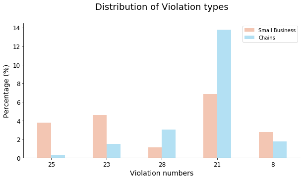

USA is a country who puts a large importance on food and has a very diverse food culture. We also have that Chicago is one of the most influential cities in the North American country. We want to combine these two insights in order to build an analysis on the food industry as it pertains to Chicago, but with a very specific viewpoint: we will look at how safe is to eat or buy food in Chicago. Specifically, we would like to focus on two main aspects: how can economic prosperity of an area influence in the frequency of inspections and violations, and an in-depth comparison between large franchises and small businesses. We believe that the conclusions extracted from such study will help to better understand this outstanding city. Let's start off!

## Data-set
We used the [Chicago Food Inspections dataset](https://www.kaggle.com/chicago/chicago-food-inspections) dataset containing a list of the inspections of food establishments in Chicago from January 1, 2010 to the present.

Each line of the dataset represents an inspection and gives us information about the establishment itself, the result of the inspection, the violations detected and others.

Below is an example with only the more relevant columns kept:

|__Name__: _Chipotle Mexican Grill_|
|---|
|__Facility Type__: Restaurant|
|__Risk__: High|
|__Zip__: 60657|
|__Results__: Pass w/ Conditions|
|__Violations__: |
| 16. food-contact surfaces: cleaned & sanitized - comments: noted a very thick black and slimy substance inside the upper compartment of ice machine dripping onto the ice. Instructed management not to use ice machine until equipment is detail cleaned and sanitize. Priority foundation #7-38-005 |
| 37. Food properly labeled; original container - comments: noted bulk food items stored inside containers at the dry storage not properly labeled. Instructed management that all bulk and working food ingredient containers must be labeled with contents name. |
| 47. Food & non-food contact surfaces cleanable, properly designed, constructed & used - comments: noted foil paper used to line shelves. Instructed to clean and remove all foil paper to prevent hiding places for pest. |
| 55. Physical facilities installed, maintained & clean - comments: noted cracks on floor at the basement dry storage area. Instructed to seal and resurface crack on floor to make them smooth and easily cleanable. |
| 55. Physical facilities installed, maintained & clean - comments: noted stained tiles on walls and ceiling by the 3 compartment sink. Instructed to detail clean and maintain.  |
| 58. Allergen training as required - comments: noted certified food managers on duty with no allergen training certification. Instructed management that all food service managers are required to have the allergen training certification.|

As can be seen most of the data is has results that are either: __Pass__, __Pass w/ Conditions__ or __Fail__. We will only be basing ourselves off that data.

There are also many different types of establishment:
- Restaurants make up __67%__ of the data.
- Grocery stores make up __13%__ of the data.
- The rest of the data is __20%__ of the data.

For the purpose of this work we only be considering restaurants.

## Part 1: Is richer safer ?

We have compared inspections based on the [income for each zip code](https://towardsdatascience.com/getting-census-data-in-5-easy-steps-a08eeb63995d).

 

The map on the left shows the income per zip and the one on the right the inspection fail rate per zip. The two maps seem very similar, although inverted. For example, the city centre has areas with very high incomes, but low fail rates. Could there perhaps exist a relation? Let's plot the trend between income and fail rates!

Indeed, a strong negative correlation can be found between income and fail rate. 

 

However, drawing conclusion directly could be a bad idea. One option is that the data is biased.For example, inspectors might be biased against restaurants in low income areas, and target them with more inspections. 

#### Are poorer areas more targeted by inspections?

All establishments have a risk group assigned to them. These risk levels have to do with how risky the kind of food being served is. There are three groups:
- __High risk__
- __Medium risk__
- __Low risk__

We do not look at the low risk group because they are so uncommon that not enough data is available to conclude anything.

 

In the graph above we see the average time between inspection per establishment for every zip code.
There doesn't seem to be any clear bias with respect to the inspection frequency.

But we can still see that areas with a lower income have a higher rate of going out of business.

 

Since there is no bias to the inspection frequency, we simply conclude that higher income areas are safer, and that a customer grabbing some food in the city center has a lower risk of having a bad time than someone having lunch in the poorer areas.

So, what could be the problem if you would happen upon a failing restaurant? Analysing the violations column will tell us just that.

### Checking the specific violations:

We firstly separate the data into two groups:
- the low income areas, the bottom 25%
- the high income areas, the top 25%

We plot the results for the different groups in a bar graph, to re-visualize the difference seen in the trend of the scatter plot.

We will slightly quantize the data by setting “Pass” as both “Pass” and “Pass w/ Conditions”, and “Fail” as just “Fail”. The other rows are not connected to the safety of the establishment.

As expected from the scatter plot, high income areas have less failures, and are safer than low income areas. We now use these two groups for the violation analysis.

First we quickly see how their inspection results are distributed to get a rough idea about the data.
The following plot shows the 5 violations that have the largest relative ratio between low and high income neighborhoods. We propose that this will indicate interesting differences in the problems a high income area has versus a low income area. 

 

 

The Violations correspond to:
- Violation 8:  Hands clean & properly washed
- Violation 16: Food-contact surfaces: cleaned & sanitized
- Violation 19: Outside garbage waste grease and storage area; clean, rodent proof, all containers covered
- Violation 22: Proper cold holding temperatures.
- Violation 5: Procedures for responding to vomiting and diarrheal events.

By looking at the distribution of violations for these two groups we find a few key differences:
- Low income areas have rodent-related violations more often, as well as with cold temperatures and procedures in case of customers getting food poisoned (hmm?).
- High income areas have more issues with unclean personnel and working surfaces.

We then use an NLP pipeline to extract which words are more common between the high and low income categories.

    

     <b>Low Income Area</b>
      
     
    

    

     <b>High Income Area</b>
      
     
    

 

As we can see, low income areas have a much greater rodent problem than high income areas, given the great weight of the words “mice” and “droppings”. High income areas have more problems concerning sushi than low income areas, probably due to sushi being a more expensive meal, and sushi restaurants would not be expected to be found in low income areas. Also, this could be related to more strict rules concerning cleanliness in sushi restaurants, which restaurants in high income areas are more likely to violate. 

So, we conclude that eating sushi in a high income area might be relatively risky, but you can be almost certain that you will not get any mice droppings on them at least.

## Part 2: Chains vs Small Businesses

The concept of restaurant chains build upon a very simple idea: that you can get the same food regardless of where you buy it. A Big Mac in New York should taste the same as a Big Mac in Chicago. Also, quality between establishments should be the same, since the company has a reputation to live up to. Does this quality extend to food safety? Are there any differences in food safety between small businesses compared to chains?

We extracted the [list of food chains](https://en.wikipedia.org/wiki/List_of_restaurant_chains_in_the_United_States) from Wikipedia to find all the big restaurant chains in the United states. For the rest of the restaurants, we assume that they are privately owned restaurants with no association to a restaurant chain.

We will now slightly quantize the data by setting <strong>“Pass”</strong> as both “Pass” and “Pass w/ Conditions”, and <strong>“Fail”</strong> as just “Fail”. The other rows are not connected to the safety of the establishment.

We choose the failure rate as the safety measurement, as a customer going to a restaurant that would fail an inspection is quite unsafe. Because the __Fischer exact test__ gives us a p-value lower than 0.01 we can deduce from the plots above that chains fail inspections less often and so are safer.

## Tying it together, are chains richer?

A perceptive reader might have noticed that there are similarities between the two parts. The bar plots concerning results for the different groups look very much the same. The fail rates for small businesses and low income areas are 22% and 23% respectively, and for restaurant chains and high income areas 16% and 18% respectively. This leads to the question: Can we find a connection between the two parts?
Given a connection between income and chains/small businesses, we should find a strong correlation between them. Our hypothesis is that if a higher percentage of chains are found in more high-income areas compared to low-income areas, food safety is not necessarily related to the type of restaurant, and instead related to the income of an area.

We can see that there is no or a very weak correlation between income chain percentage, and we find a correlation of only 0.14.

For example, the area with the third highest concentration of restaurant chains, has the lowest income. In contrast to this, the area with the fourth highest concentration of restaurant chains has the second highest income!

This disproves eventual thoughts about connections, but to make it even more clear, we will do an in-depth look at the violations for chains and small businesses.

#### Violations between chains and small businesses

 

Violation 21 is clearly overrepresented in chains compared to small businesses, which corresponds to a lack of a certified food service manager when handling hazardous foods, such as deli meats, sandwiches, fish and many others.
Small businesses are highly overrepresented in: violation 25, which corresponds to toxic items not stored properly, and violation 23, which concerns date labeling refrigerated food.

    

     <b>Chains</b>
      
     
    

    

     <b>Small Businesses</b>
      
     
    

 

Here we don’t see any great similarities either. You can find “droppings” in the small business cloud, but otherwise it is hard to distinguish any similarities. 

From these results, we conclude that there must be different factors at play making high income areas and restaurant chains safer. 

