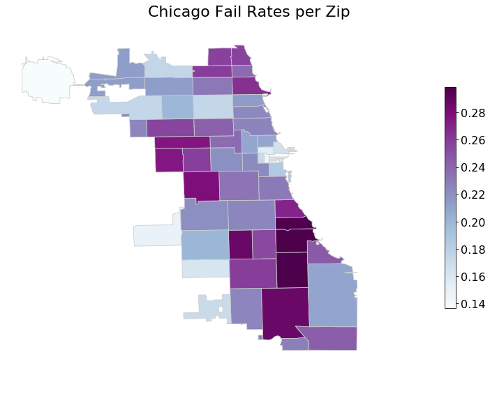

### Abstract

## Data-set
We used the [Chicago Food Inspections dataset](https://www.kaggle.com/chicago/chicago-food-inspections) dataset containing a list of the inspections of food establishments in Chicago from January 1, 2010 to the present.

Each line of the dataset represents an inspection and gives us information about the establishment itself, the result of the inspection, the violations detected and others.

Below is an example with only the more relevant columns kept:

|__Name__: _Chipotle Mexican Grill_|
|---|
|__Facility Type__: Restaurant|
|__Zip__: 60657|
|__Results__: Pass w/ Conditions|
|__Violations__: |
| 16. food-contact surfaces: cleaned & sanitized - comments: noted a very thick black and slimy substance inside the upper compartment of ice machine dripping onto the ice. Instructed management not to use ice machine until equipment is detail cleaned and sanitize. Priority foundation #7-38-005 | 
| 37. Food properly labeled; original container - comments: noted bulk food items stored inside containers at the dry storage not properly labeled. Instructed management that all bulk and working food ingredient containers must be labeled with contents name. | 
| 47. Food & non-food contact surfaces cleanable, properly designed, constructed & used - comments: noted foil paper used to line shelves. Instructed to clean and remove all foil paper to prevent hiding places for pest. | 
| 55. Physical facilities installed, maintained & clean - comments: noted cracks on floor at the basement dry storage area. Instructed to seal and resurface crack on floor to make them smooth and easily cleanable. | 
| 55. Physical facilities installed, maintained & clean - comments: noted stained tiles on walls and ceiling by the 3 compartment sink. Instructed to detail clean and maintain.  | 
| 58. Allergen training as required - comments: noted certified food managers on duty with no allergen training certification. Instructed management that all food service managers are required to have the allergen training certification.|

As can be seen most of the data is has results that are either: __Pass__, __Pass w/ Conditions__ or __Fail__. We will only be basing ourselves off that data.

There are many different establishment types:
- Restaurants make up __67%__ of the data.
- Grocery stores make up __13%__ of the data.
- The rest of the data is __20%__ of the data.

For the purpose of this work we look more closely at the restaurants.

## Part 1: Is richer safer ?

We have compared inspections based on the [income for each zip code](https://towardsdatascience.com/getting-census-data-in-5-easy-steps-a08eeb63995d)

## Part 2: Chains vs Businesses
